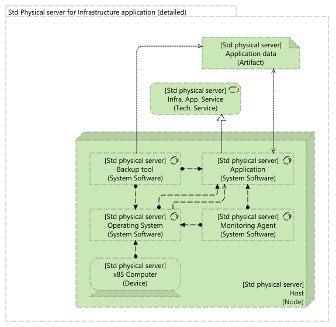
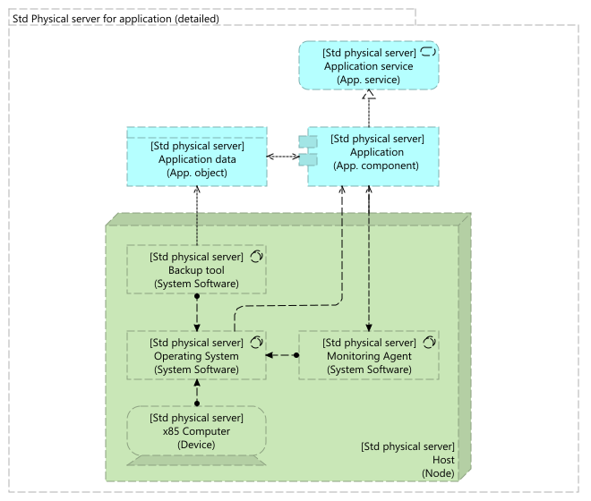

# Archimate-Patterns
Publish Archimate Patterns

## Technical Layer

| Pattern | Description |
|--|--|
|  | [Pattern 1: Standalone server for infrastructure application](technical-layer/standalone-physical-server-for-infrastructure-application/) |
|  | [Pattern 2: Standalone server for application](technical-layer/standalone-physical-server-for-infrastructure-application/) |
