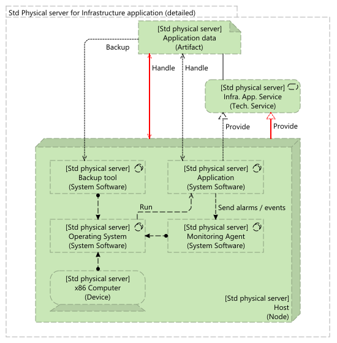
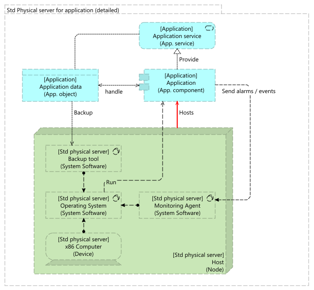
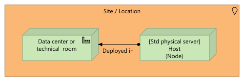

# Technical layer

| Pattern | Description |
|--|--|
|  | [T001: Standalone server for infrastructure application](standalone-physical-server-for-infrastructure-application/) |
|  | [T002: Standalone server for application](standalone-physical-server-for-infrastructure-application/) |
|  | [T003: Standalone physical server implemention](standalone-physical-server-for-infrastructure-application/) |
