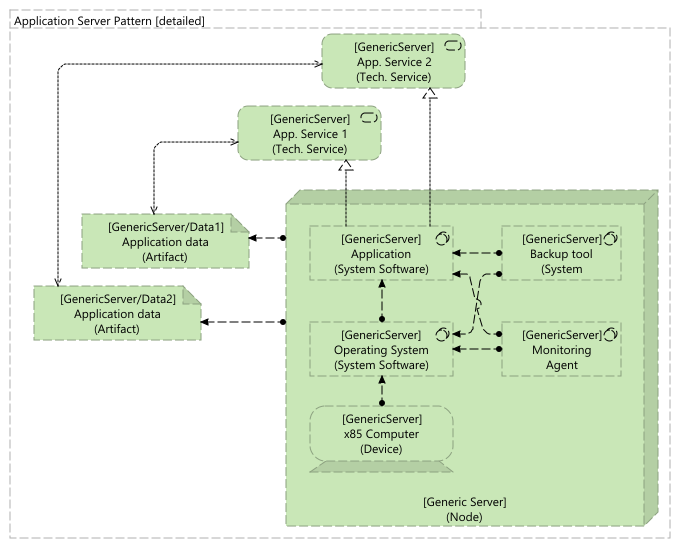
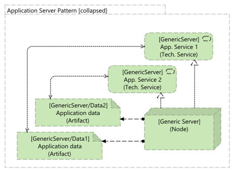
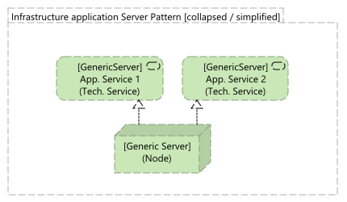

# Standalone physical server for infrastructure application

## Description
Standalone server, hosting an infrastructure application, providing an infrastructur service (like a database)

## Contexte / Problem
Provide an infrastructure application and/or an infrastructure service, with a server. No virtualization available

## Solution
Physical servers hosting the infrastructure application. Backup and monitoring are important for

## Security

Standard security rules

* [x] Regular firmware upgrade,
* [x] Operating system security patching,
* [x] Application security patching,
* [x] No application running with the root access.

## Robustness

* [x] Fault tolerance (*)
* [ ] Disaster recovery
* [ ] Fail-over

(*) No fault tolerance can be provided except if some physical components like network interface, disks, ... are doubled

## Performances

Not applicable

## Evolutivity

Low. Capacity can be increase on some components like the memory, or the disks, but with limitations, and constraints.

## Integrations

Not applicable

## Patterns

## Known use cases

* No virtualization available,
* Host an infrastructure application in Development, and/or QA environment, 
* Host an infrastructure application in production environment, for non-critical applications.
