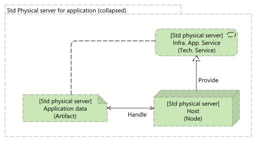
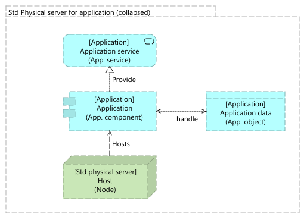

# Standalone physical server for application

## Description
Standalone server, hosting an application, providing a service (like a database, or an application)

## Context / Problem
Provide an application and/or a service, with a server. No virtualization available

## Solution
Physical server hosting the application. Backup and monitoring are important for ensuring no data loss, and maximize the availability.

## Security

Standard security rules
* [x] Regular firmware upgrade,
* [x] Operating system security patching,
* [x] Application security patching,
* [x] No application running with the root access.

## Robustness

In summary 
* [x] Fault tolerance (\*)
* [ ] Fail-over
* [ ] Disaster recovery

(\*) By default, no fault tolerance is provided, except if we have components redundancy (some components like network interface, disks, ... can be doubled)

| Parameter | Value |
|----|----|
| Overall availability | > 99% (\*) |
| RTO | Depends on the support contract attached to the server. Consider 1 day as a minimum |
| RPO | Worst case: 24 hours, with a daily backup Small RPO with more frequent backup  Significant improvement if the logs are stored outside of the server | 

(\*) Considering components redundancy.

## Performances

Not applicable

## Evolutivity

Low. Capacity can be increase on some components like the memory, or the disks, but with limitations, and constraints.

## Integrations

Not applicable

## Patterns

## Known use cases

* No virtualization available,
* Host an infrastructure application in Development, and/or QA environment, 
* Host an infrastructure application in production environment, for non-critical applications.
